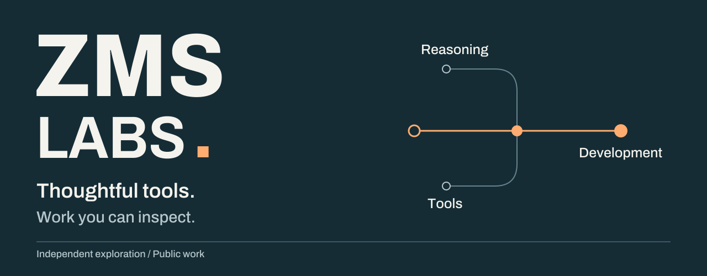
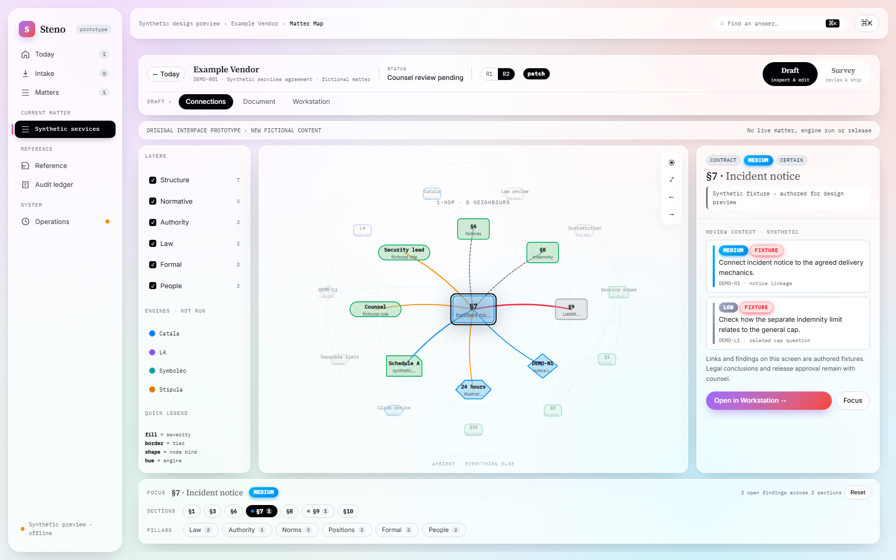
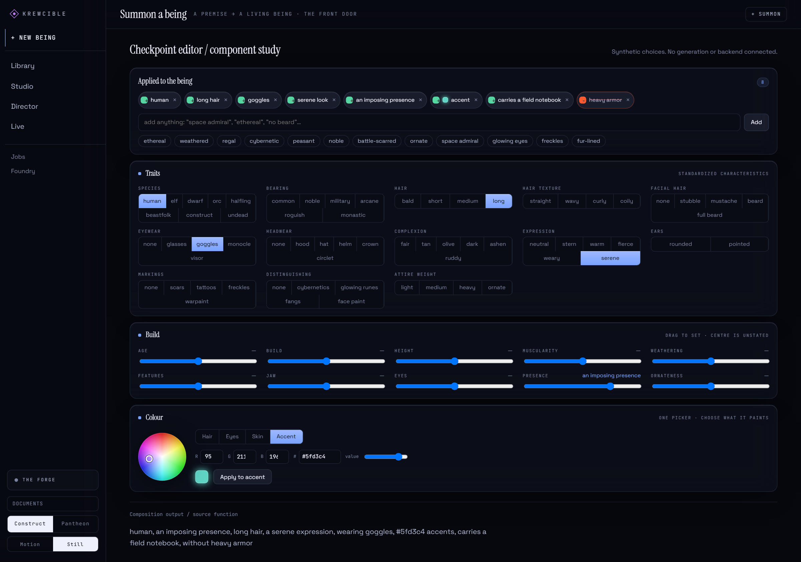
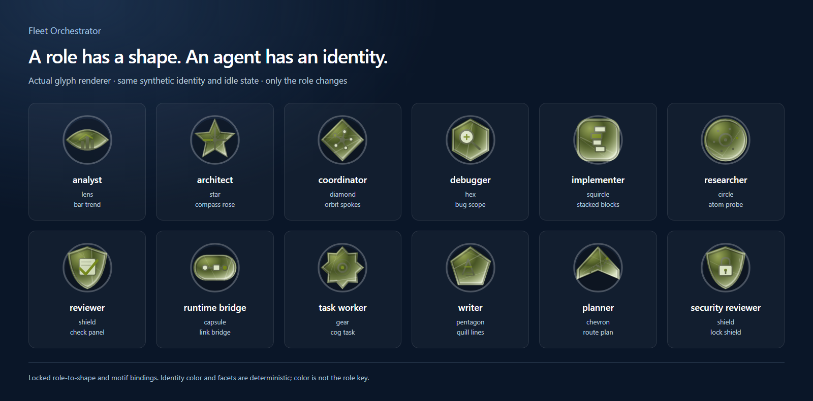

<picture>
  <source media="(max-width: 600px)" srcset="assets/zms-labs-mobile.svg">
  
</picture>

# ZMS Labs · Selected work

**Tools for work that takes judgment.**

Independent projects exploring how software can make complex information, decisions, and creative work easier to understand. This portfolio connects product design with implementation choices and evidence you can inspect.

[**Explore the full showcase →**](https://zms-labs.github.io/showcase/) · [About this work](https://zms-labs.github.io/showcase/about.html) · [Supporting work](https://zms-labs.github.io/showcase/more-work.html) · [Evidence and attribution](https://zms-labs.github.io/showcase/evidence.html) · [Maintain this site](docs/MAINTAINING.md)

## Selected projects and concrete questions

| Project | Question and inspectable work |
|---|---|
| [**Steno**](https://zms-labs.github.io/showcase/case-studies/steno/) | **How could a contract workstation connect a clause to the questions it raises?** An archived workspace prototype, the current Hallmark emblem system, and separate recorded drafting checks |
| [**Epistemic Skills**](https://zms-labs.github.io/showcase/case-studies/epistemic-skills/) | **How can agents investigate, compare alternatives, and verify their work more systematically?** Public methods, worked examples, design rationale, and evaluation limits |
| [**Gridiron**](https://zms-labs.github.io/showcase/case-studies/gridiron/) | **How can commentary stay accountable to a recorded event?** A synthetic replay, its evidence boundaries, and a downloadable research-source snapshot |
| [**Krewcible**](https://zms-labs.github.io/showcase/case-studies/krewcible/) | **How can a creative tool keep choices visible and editable?** Existing checkpoint-editor components before and after exercised controls with synthetic state |
| [**Fleet Orchestrator**](https://zms-labs.github.io/showcase/case-studies/fleet-orchestrator/) | **How can agent identity and accountable work outlast a runtime session?** Authentic cockpit and glyph design, a Surface Bridge explanation, and a tested review gate |
| [**SaveBench**](https://zms-labs.github.io/showcase/case-studies/savebench/) | **Can a failed measuring instrument justify a contestant verdict?** A dated control-repair case, frozen targets, observed windows and explicit limits |
| [**Neuraxic**](https://zms-labs.github.io/showcase/case-studies/neuraxic/) | **How can an author explore alternate continuity while keeping canon explicit?** Focused branch-visibility evidence and an independently authored fictional explanation |
| [**Enaction**](https://zms-labs.github.io/showcase/case-studies/enaction/) | **Who is speaking, and whose memory should change?** Explicit fictional-role selection and twelve focused tests of memory attribution and operator boundaries |
| [**ZMS Canvas**](https://zms-labs.github.io/showcase/case-studies/zms-canvas/) | **What happens to edits when a save fails or another revision arrives first?** Six focused recovery and storage tests in a public PenEcho fork, with upstream attribution |

## Product design you can examine

**Steno · Connecting document context and review questions.** The case study preserves the prototype's visual language and offers a full-resolution gallery and a captioned prototype recording. The [Hallmark gallery](https://zms-labs.github.io/showcase/case-studies/steno/#hallmarks) also examines the implemented emblem language: modeled grade, facet geometry and distinct evidence marks. Recorded drafting checks remain separate from the design specimens.

**Krewcible · Shape the idea. See what changed.** Watch the captioned component recording and inspect the initial and changed states, the controls exercised, and the limits of the study. These captures do not demonstrate a generation service or persistent storage.

**Fleet Orchestrator · Recognizable agents. Accountable work.** Inspect the glyph vocabulary, the Stratus home rendered with synthetic work, and the Surface Bridge's place between coordination and runtime execution. The review-gate walkthrough supplies a focused behavioral example alongside the design.

## Substance behind the presentation

- **Purpose and tradeoffs:** each case study explains the problem, design choices, implemented slice, and remaining questions.
- **Evidence near the claim:** prototype images, component interactions, recorded results, and conceptual illustrations are identified as different kinds of artifacts.
- **Inspectable work:** [Epistemic Skills](https://github.com/ZMS-Labs/epistemic-skills) has public source; Gridiron includes a reviewed source snapshot. Steno, Krewcible, Fleet Orchestrator, SaveBench, Neuraxic and Enaction share selected case-study material while their application source remains private.
- **Clear authorship:** these are personally directed projects developed with AI assistance. [Attribution and provenance](https://zms-labs.github.io/showcase/evidence.html) explain the assistance and the work shown.

These are independent projects with different stages of maturity. The showcase does not establish employer deployment, production readiness, or measured improvement in agent performance.

A real Epistemic Skills task is reproducible from this repository: run `python scripts/replay_manifest_case.py` in a full clone to inspect the original publication's manifest mismatch and correction. It uses public Git objects, Python and Git; no model account is required.

## Read, run, maintain

The site is plain HTML, CSS, and JavaScript in [`docs/`](docs/README.md). Open `docs/index.html` locally or run `python -m http.server 8000 --directory docs`. It needs no build service, model account, external font request, or application backend.

[Maintenance and verification](docs/MAINTAINING.md) · [Design decisions](DESIGN.md) · [Asset provenance](docs/assets/manifest.json) · [Documentation standard](https://github.com/ZMS-Labs/.github/blob/main/docs/documentation-standard.md#use-visuals-to-explain)

See [LICENSE](LICENSE) and [asset notices](assets/README.md). The Gridiron download retains its own declarations and third-party notices. Publishing this portfolio does not publish or deploy the private applications.
