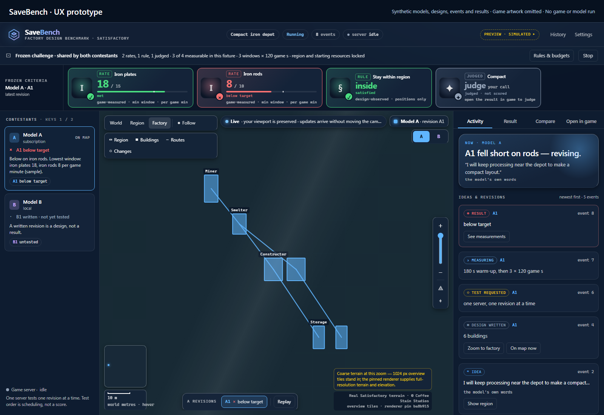

<picture>
  <source media="(max-width: 600px)" srcset="assets/zms-labs-mobile.svg">
  
</picture>

# Selected work by Zach Stern

I'm Zach Stern. I work with contracts. These are projects I'm building around contracts, writing, games and the practical problems I run into with AI tools. Steno starts from a question like this one: if a vendor reports a data incident, who needs to be told, and how do the liability terms change the answer?

AI tools write the code. I decide what each project is for and check what comes back. I want this site to show what I've been up to with AI and how it's actually going, without overstating any of it.

[Explore the full showcase](https://zms-labs.github.io/showcase/) · [About](https://zms-labs.github.io/showcase/about.html) · [How I work with AI tools](https://zms-labs.github.io/showcase/about.html#how-i-work) · [More work](https://zms-labs.github.io/showcase/more-work.html) · [Evidence and attribution](https://zms-labs.github.io/showcase/evidence.html)

## A look at the featured projects

### Steno: a contract workstation

Steno is a contract workstation that keeps the document, its connections and the questions under review together. The case study shows the archived prototype in full resolution and in a short captioned recording. It also shows the Hallmark, the emblem Steno uses to show a grade and what backs it, drawn with made-up inputs, so no contract was assessed. Two drafting checks, recorded on made-up clauses, have their own page.

[Watch the prototype recording](https://zms-labs.github.io/showcase/case-studies/steno/#recording) · [See the Hallmark designs](https://zms-labs.github.io/showcase/case-studies/steno/#hallmarks) · [Read the drafting checks](https://zms-labs.github.io/showcase/case-studies/steno/recorded-checks/)

### SaveBench: factories in Satisfactory

SaveBench gives AI models a factory to design in the video game Satisfactory, and the running game measures what the factory delivers. The case study shows the comparison prototype on made-up data, then a real experiment from 9 September 2026. An AI agent designed a copper and concrete factory for it. On the first trial the measuring tool failed its own check, so nothing was judged. After a repair, the same design missed its targets in two of its three two-minute measuring windows, and that FAIL is kept as recorded. Later records show that on 13 September, factories designed by AI models passed a harder challenge in the game with faster belts allowed. A newer test, where the factory has to keep producing while nobody touches it, has no pass yet. Dates are UTC, as in the run records.

[Watch the prototype recording](https://zms-labs.github.io/showcase/case-studies/savebench/#recording) · [See the trials](https://zms-labs.github.io/showcase/case-studies/savebench/#walkthrough)

### Epistemic Skills: checking an AI agent's work

Epistemic Skills is a set of seventeen written methods that an AI agent (an AI tool that carries out a multi-step task on its own) can load when a task calls for one: to investigate a failure, compare options or check whether a change worked. The source is public, in eleven releases since July 2026. The comparisons so far haven't shown whether the methods make agents better.

[Read the case study](https://zms-labs.github.io/showcase/case-studies/epistemic-skills/) · [Browse the source](https://github.com/ZMS-Labs/epistemic-skills)

### Fleet Orchestrator: keeping track of AI agents

I wanted to keep track of several AI coding agents without losing their work between sessions. Fleet Orchestrator is the workspace I'm designing for that: each agent gets a recognizable glyph, and its conversation, tasks and reviews stay together. The case study shows the glyph designs and the main screen with made-up agents. It also explains the Surface Bridge, the part that takes a decision about what an agent should do next, turns it into commands for whichever AI tool is running that agent, and reports back how it went. Three of the project's own tests passed on its review gate, the check that holds an agent's work back while a serious problem found in review is still open.

[See the glyph designs](https://zms-labs.github.io/showcase/case-studies/fleet-orchestrator/#glyphs)

Neuraxic and Krewcible have short recordings too: [Neuraxic](https://zms-labs.github.io/showcase/case-studies/neuraxic/#recording) · [Krewcible](https://zms-labs.github.io/showcase/case-studies/krewcible/#recording)

## The questions behind the projects

Each project started with a question. The line under each one says how the work is shown and what works so far, and the label links to the key on the Evidence page.

### Featured

- [Steno](https://zms-labs.github.io/showcase/case-studies/steno/): How could a contract workstation connect a clause to the questions it raises? [Prototype](https://zms-labs.github.io/showcase/evidence.html#status) · the archived prototype design, the current Hallmark emblem, and two drafting checks recorded on made-up clauses
- [SaveBench](https://zms-labs.github.io/showcase/case-studies/savebench/): How would AI models approach building a factory in Satisfactory, and would it actually work in the game? [Recorded experiment](https://zms-labs.github.io/showcase/evidence.html#status) · the original interface on made-up data, a factory an AI agent designed that the game scored as a FAIL, and later designs that passed in the game
- [Epistemic Skills](https://zms-labs.github.io/showcase/case-studies/epistemic-skills/): How do I get AI agents to investigate a problem properly and check whether their change worked? [Public source](https://zms-labs.github.io/showcase/evidence.html#status) · public releases, and one recorded use on this site (19 September 2026) with a check anyone can rerun
- [Fleet Orchestrator](https://zms-labs.github.io/showcase/case-studies/fleet-orchestrator/): How do I keep track of several AI coding agents without losing their work between sessions? [Component study](https://zms-labs.github.io/showcase/evidence.html#status) · the glyphs and main screen from the project's own code, and three review-gate tests passed

### Supporting

- [Neuraxic](https://zms-labs.github.io/showcase/case-studies/neuraxic/): Can a story's prose, people, places and rules develop together, and can I try another version without losing what I've already decided? [Interface study](https://zms-labs.github.io/showcase/evidence.html#status) · the app's own screens with a made-up story world, and five tests passed on what each version of the story can see and how a new detail gets accepted
- [Krewcible](https://zms-labs.github.io/showcase/case-studies/krewcible/): Can I shape a character through choices I can see, change and take back one at a time? [Component study](https://zms-labs.github.io/showcase/evidence.html#status) · the editor's own controls, recorded with made-up choices; no test was run and no image was generated
- [Gridiron](https://zms-labs.github.io/showcase/case-studies/gridiron/): Can commentary for a football video game follow what happened on the field? [Public source](https://zms-labs.github.io/showcase/evidence.html#status) · a research snapshot you can download, two recorded runs of one made-up drive, and 44 tests passed; not yet tested against the real game
- [Enaction](https://zms-labs.github.io/showcase/case-studies/enaction/): When someone plays a fictional role, whose memory should change, the character's or theirs? [Component study](https://zms-labs.github.io/showcase/evidence.html#status) · twelve tests passed that keep the memories a scene creates with the character and off the player's own record
- [Poiesis](https://zms-labs.github.io/showcase/case-studies/poiesis/): When several apps share one generation service, how do I know what came back, and how long should it be kept? [Component study](https://zms-labs.github.io/showcase/evidence.html#status) · eight tests passed: a returned file is exactly the one that was made, files expire after 24 hours whether or not anyone collects them, and a stored prompt becomes unreadable once a job finishes

## How to read the work

Each case study starts with what I wanted, explains the design choices, and says what's built, what ran and what's still open. Prototype images, working pieces, recorded results and concept illustrations are each labeled as what they are, and the [Evidence page](https://zms-labs.github.io/showcase/evidence.html) has a dated record for every project.

You can check some of the work yourself. [Epistemic Skills](https://github.com/ZMS-Labs/epistemic-skills) is a public repository, and the Gridiron case study has a source download you can run. The other seven projects keep their source private, so their case studies show screens, recordings and test results instead.

These are personal projects. Questions and conversations are welcome through [my GitHub profile](https://github.com/SternOne).

### Check one result yourself

When this site was first published, a check found that 14 of the site's 28 files did not match its manifest, the list of the site's files with a fingerprint (a SHA-256 hash) of each. The task record names the method as Did It Land, one of the Epistemic Skills methods. The working copy had Windows line endings, and Git stored the files with Unix ones. The corrected commit has no mismatches, and all 28 files on the live site then matched it. To see both results from public Git history, run `python scripts/replay_manifest_case.py` in a full clone; it needs only Python and Git.

## Running and maintaining the site

The site is plain HTML, CSS, and JavaScript in [`docs/`](docs/README.md). Open `docs/index.html` locally or run `python -m http.server 8000 --directory docs`. It needs no build service, model account, external font request, or application backend.

[Maintaining this site](MAINTAINING.md) · [Design decisions](DESIGN.md) · [Asset manifest](docs/assets/manifest.json) · [Documentation standard](https://github.com/ZMS-Labs/.github/blob/main/docs/documentation-standard.md#use-visuals-to-explain)

Showcase site, Copyright (C) 2026 ZMS Labs / Zach Stern. This site is distributed under GPL-3.0-or-later; see [LICENSE](LICENSE) and [asset notices](assets/README.md). The Gridiron download keeps its own declarations and third-party notices.
