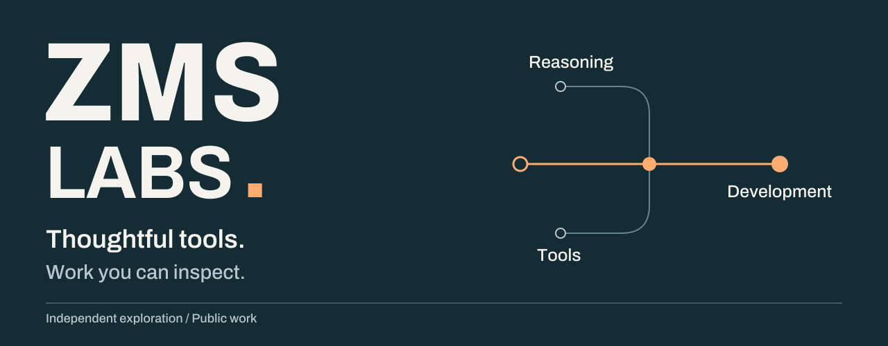
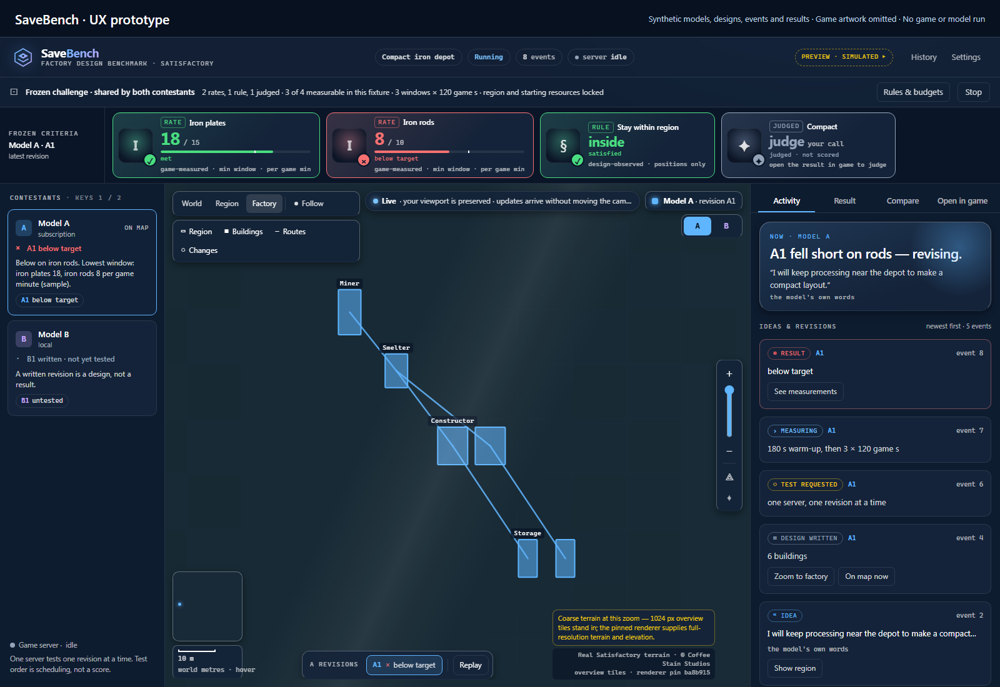

<picture>
  <source media="(max-width: 600px)" srcset="assets/zms-labs-mobile.svg">
  
</picture>

# Zach Stern: commercial lawyer, and what I build with AI

This repository is the source of my site, [sternone.net](https://sternone.net/).

I'm a commercial lawyer. For nearly ten years I was the primary in-house lawyer for Dovenmuehle's purchasing-side commercial and technology agreements, and before that I spent seven years as an attorney at Tishler &amp; Wald in commercial financing and litigation. I turn contract terms into decisions a business can act on, and I build the processes that make the next agreement easier.

ZMS Labs is the name I use for my independent projects. AI tools write the code. I decide what each project is for and check what comes back.

[Experience](https://sternone.net/#experience) · [Work](https://sternone.net/more-work.html) · [About](https://sternone.net/about.html) · [How I work with AI tools](https://sternone.net/about.html#how-i-work) · [Sources and records](https://sternone.net/evidence.html)

## Professional work

- [Commercial agreements at Dovenmuehle](https://sternone.net/commercial-agreements.html), 2017 to 2026: the negotiations, the practical advice, and the contract rider, negotiation reference, NDA process and assurance-report process I built.
- [One court process for more than 100 competing claims](https://sternone.net/ear.html), Tishler &amp; Wald: a court claims process after an equipment lessee's bankruptcy, and a $17,487,520.30 competing claim defeated and affirmed on appeal.

## Independent projects

- [SaveBench](https://sternone.net/case-studies/savebench/): can an AI design a factory that actually runs? AI models design factories in Satisfactory and the running game measures what they deliver. The test checks its own measuring tool first and keeps failed runs on the record.
- [Steno](https://sternone.net/case-studies/steno/): a contract workstation that keeps the question next to the words. Two of its drafting checks flagged two gaps in a sample agreement and came back clean after the edits.
- [Epistemic Skills](https://sternone.net/case-studies/epistemic-skills/): seventeen public methods that teach AI agents to find the real cause and check their own work. [Source on GitHub](https://github.com/ZMS-Labs/epistemic-skills).
- [Fleet Orchestrator](https://sternone.net/case-studies/fleet-orchestrator/): a control room for a team of AI agents, built so their work can outlast a session.
- [Neuraxic](https://sternone.net/case-studies/neuraxic/): a writing studio where a new story fact waits for the author's OK before it becomes settled.
- [Krewcible](https://sternone.net/case-studies/krewcible/): character design from choices you can see, change and take back.
- [Gridiron](https://sternone.net/case-studies/gridiron/): football commentary that waits for the facts. Includes a source download you can run.
- [Enaction](https://sternone.net/case-studies/enaction/): role-play where each character keeps its own memory, apart from yours.
- [Poiesis](https://sternone.net/case-studies/poiesis/): a shared AI generation service with receipts and expiry dates.

Each project page says what ran and when, what's sample content, and what hasn't been tested yet. The [Sources page](https://sternone.net/evidence.html) has a dated record for every project. These are personal projects; questions and conversations are welcome through [LinkedIn](https://www.linkedin.com/in/zachary-s-21125214/).

### Check one result yourself

When this site was first published, a check found that 14 of its 28 files didn't match the list of what had been checked: the Windows working copy used different line endings from the ones Git stored. The corrected list had no mismatches, and all 28 files on the live site then matched it. To see both results from public Git history, run `python scripts/replay_manifest_case.py` in a full clone. It needs only Python and Git.

## Running and maintaining the site

The site is plain HTML, CSS and JavaScript in [`docs/`](docs/README.md). Open `docs/index.html` locally or run `python -m http.server 8000 --directory docs`. It needs no build step, model account, external font request or application backend.

[Maintaining this site](MAINTAINING.md) · [Design decisions](DESIGN.md) · [Asset manifest](docs/assets/manifest.json)

Copyright (C) 2026 ZMS Labs / Zach Stern. This site is distributed under GPL-3.0-or-later; see [LICENSE](LICENSE) and [asset notices](assets/README.md). The Gridiron download keeps its own declarations and third-party notices.
